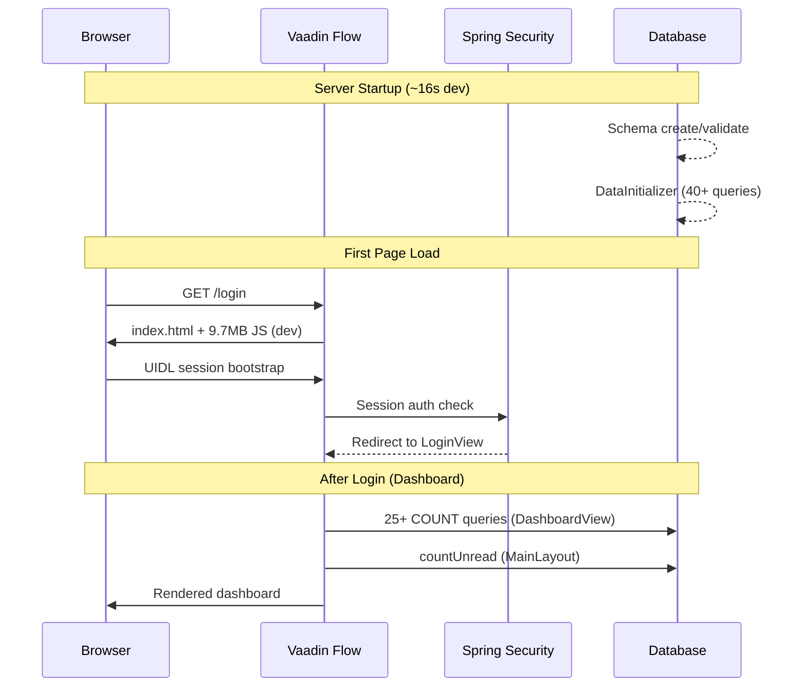

# Startup & Initial Page Load Performance Report

**Application:** crm-app (Spring Boot 3.3.5 + Vaadin Flow 24.5.6)  
**Date:** 2026-06-11  
**Environment measured:** `dev` profile (H2 in-memory, `ddl-auto=create-drop`, profiling enabled)  
**Method:** Temporary instrumentation in `com.crm.config.performance.*` + live JVM measurements

> **Note:** Default `application.properties` activates `prod` (remote Neon PostgreSQL). Local measurements used `dev` for reproducibility. Production estimates are noted where they differ materially.

---

## Executive Summary

| Metric | Measured Value |
|--------|----------------|
| **Server startup (JVM → ready)** | **15.7–16.4 s** |
| **Spring context refresh (Hibernate + beans)** | **5.0–5.8 s** (~35% of startup) |
| **Data seeding (`DataInitializer`)** | **426–579 ms** |
| **Dashboard DB load (25+ queries)** | **93 ms** (empty H2; scales with DB latency × query count) |
| **First HTTP response (`/login`)** | **161 ms** |
| **Vaadin dev JS bundles (total)** | **9.71 MB** (5.66 MB is dev-only Copilot) |
| **Heap at application-ready** | **126–196 MB** |

**Primary bottlenecks:** Hibernate schema creation (dev), Vaadin dev-mode frontend bundles, N+1 dashboard COUNT queries, per-startup data seeding checks, and (in prod) remote database round-trip latency.

---

## 1. Startup Phase Breakdown

Instrumentation added under `src/main/java/com/crm/config/performance/`. Enable with:

```properties
app.performance.profiling=true
app.performance.probe-dashboard=true   # optional: simulates DashboardView DB load at startup
```

### Measured Phases (Run 2 — representative)

| Phase | Duration | % of Startup | Notes |
|-------|----------|--------------|-------|
| Application bootstrap (`SpringApplication.run`) | ~15.7 s total | 100% | Includes Maven fork overhead in `spring-boot:run` |
| Context refresh (Hibernate + DI wiring) | **5,023 ms** | **32%** | Dominated by H2 `create-drop` DDL + entity scanning |
| Data initializer (total) | **426 ms** | **2.7%** | Runs on every startup |
| ↳ Topic seeding | 143 ms | | 40× `existsByName` + occasional saves |
| ↳ Notification config seeding | 46 ms | | 14× `existsByTopicKeyAndWorkspaceIdIsNull` |
| Time-clock holiday bootstrap | 7 ms | <0.1% | Skipped when holidays exist |
| Dashboard DB probe | 93 ms | 0.6% | Simulates authenticated landing page queries |
| Application-ready (total elapsed) | 13,888 ms | | Excludes Maven plugin overhead |

### Phase Details

#### Application Bootstrap (~16 s)
Spring Boot context creation, component scanning (~150+ beans), Vaadin route registration, Spring Security filter chain setup. No external HTTP APIs are called during bootstrap.

#### Database Connection Initialization
- **Pool:** HikariCP, 10 connections pre-warmed at start (`idle=10, total=10`).
- **Dev:** H2 in-memory with `create-drop` — full schema recreated each boot (~5 s in context refresh).
- **Prod:** `ddl-auto=validate` against Neon PostgreSQL — schema validation only; estimated **1–3 s** including network RTT (not measured live; depends on region).

#### External API / Service Initialization
- **SMTP (JavaMailSender):** Configured at startup; no connection opened until first email.
- **Israeli holidays (KosherJava/zmanim):** Only runs when holiday table is empty; 7 ms when skipped.
- **No outbound REST/WebClient calls** during startup.

#### Authentication Initialization
- Spring Security + Vaadin WebSecurity configured during context refresh (included in 5 s phase).
- JWT filter registered for `/api/**` only; UI uses session auth.
- Locale resolution on UI init: instrumented as `phase.authentication-locale-init` (sub-ms on H2).

#### Cache Loading
- **None at startup.** Caffeine used only for OTP codes (on-demand). Email templates loaded lazily into a `ConcurrentHashMap`.

#### Frontend Bundle Loading (first browser visit)
Vaadin Flow serves server-rendered HTML; client downloads JS bundles from `/VAADIN/build/`:

| Bundle | Size | Purpose |
|--------|------|---------|
| `copilot-global-vars-later-*.js` | **5,663 KB** | **Dev-only** Vaadin Copilot |
| `indexhtml-*.js` | 2,795 KB | App shell + components |
| `generated-flow-imports-*.js` | 1,061 KB | Flow component imports |
| `FlowClient-*.js` | 243 KB | Vaadin client engine |
| Other (icons, bootstrap, plugins) | ~165 KB | |
| **Total** | **9.71 MB** | Dev mode |

Production profile (`-Pproduction`) excludes `vaadin-dev` and runs `build-frontend` — estimated **~3–4 MB** total (no Copilot, minified + compressed).

#### Initial API / Server Requests
Vaadin UI does **not** call REST endpoints on load. Communication is UIDL over HTTP.

| Request | Time | Notes |
|---------|------|-------|
| `GET /login` (first) | 161 ms | Includes Vaadin session creation |
| `GET /` | 41 ms | Redirect |
| `GET /actuator/health` | 1,735 ms | Full health aggregation (DB check) |

Authenticated dashboard adds **25+ sequential DB queries** in `DashboardView` constructor plus `alertService.countUnread()` in `MainLayout.onAttach`.

---

## 2. Top 10 Slowest Operations

| Rank | Operation | Measured | Est. Impact on Load | Root Cause |
|------|-----------|----------|---------------------|------------|
| 1 | Hibernate schema `create-drop` (dev) | ~5,000 ms | **~5 s cold start** | Full DDL on every boot in dev profile |
| 2 | Vaadin dev JS download (first visit) | 9.71 MB | **3–15 s** on 1–10 Mbps | Dev-mode bundles incl. 5.7 MB Copilot |
| 3 | `DataInitializer.seedTopics()` | 143–258 ms | **~150–250 ms** every boot | 40 individual `existsByName` queries |
| 4 | `DataInitializer` (admin/workspace) | ~280 ms | **~280 ms** | Password encoding + existence checks |
| 5 | Dashboard: 25× COUNT queries | 93 ms (empty H2) | **250–800 ms** on remote PG | N+1 query pattern, no aggregation |
| 6 | `findExpiringWithin(30).size()` | 4 ms (empty) | **50–500 ms** with data | Loads full `Contract` entities + DTO mapping for count |
| 7 | `activityRepository.countByStatus(OPEN)` | 31 ms | Variable | Likely first-query Hibernate plan compilation |
| 8 | Actuator `/health` | 1,735 ms | N/A (ops endpoint) | DB connectivity + full context check |
| 9 | `MainLayout` alert poll | 60 s interval | Background load | `countUnread()` every 60 s per open session |
| 10 | `NotificationTriggerService` scans | Every 15 min | Background | Multiple full-table scans (not startup) |

---

## 3. Issues Identified

### Slow / Inefficient Database Access

| Issue | Location | Severity |
|-------|----------|----------|
| **25+ individual COUNT queries** on dashboard load | `DashboardView.java` constructor | High |
| **`findExpiringWithin().size()`** fetches all rows | `ContractService.java:78-80` | High (with data) |
| **40× `existsByName`** on every startup | `DataInitializer.seedTopics()` | Medium |
| **14× config existence checks** on every startup | `DataInitializer.seedNotificationConfigs()` | Low |
| **`show-sql=true` in dev** | `application-dev.properties` | Low (dev only) |

### Blocking / Synchronous Operations

- `DashboardView` constructor blocks UI thread until all queries complete (Vaadin server-side rendering).
- `DataInitializer` and `TimeClockBootstrap` run synchronously on the main thread before `ApplicationReadyEvent`.
- BCrypt password encoding in `DataInitializer` when creating users (intentional, only on first boot).

### Unnecessary Startup Work

- Topic/config seeding runs **every** startup even when data exists (existence checks only).
- H2 `create-drop` rebuilds entire schema on every dev restart.
- Vaadin Copilot dev bundles downloaded on every first visit in dev mode.

### Large Frontend Assets

- **9.71 MB** total JS in dev mode; **5.66 MB** is Copilot (not needed in production).
- No custom CDN or HTTP cache headers configured for `/VAADIN/` assets.

### Repeated / Duplicate Requests

- Dashboard re-executes all 25 queries on **every navigation** to `/` or `/dashboard` (no caching).
- `wonOpps` / `lostOpps` counted in KPI row, then stage counts query overlapping stages again.
- `MainLayout` + dashboard both hit DB on attach (`countUnread` + dashboard stats).

### Memory / CPU

- Heap at ready: **126–196 MB** — healthy for this app size.
- No memory pressure observed during startup.
- Holiday generation (when triggered) is CPU-intensive (KosherJava calendar math) but runs once.

---

## 4. Recommendations

### High Impact

| # | Recommendation | Effort | Expected Improvement |
|---|----------------|--------|----------------------|
| H1 | **Consolidate dashboard stats** into 1–2 JPQL/native aggregation queries (or a `DashboardStatsService` with single `@Query`) | Medium | **200–600 ms** faster dashboard load on PostgreSQL; reduces DB round-trips from 25 → 1–2 |
| H2 | **Add `countExpiringWithin(int days)`** using `@Query("SELECT COUNT…")` instead of `findExpiringWithin().size()` | Low | **50–500 ms** when contracts table has rows |
| H3 | **Use production Vaadin build** (`-Pproduction`) for deployed environments | Low | **3–8 s** faster first page load on typical networks (removes 5.7 MB Copilot + minification) |
| H4 | **Cache dashboard stats** (Caffeine, 30–60 s TTL, keyed by workspace) | Medium | **~90%** reduction on repeat dashboard visits |
| H5 | **Switch dev to persistent H2 or `ddl-auto=update`** instead of `create-drop` | Low | **~3–5 s** faster dev restarts |

### Medium Impact

| # | Recommendation | Effort | Expected Improvement |
|---|----------------|--------|----------------------|
| M1 | **Batch `DataInitializer` checks** — `SELECT name FROM topics` once, diff in memory | Low | **100–200 ms** per startup |
| M2 | **Lazy-init dashboard charts** — load KPI row first, defer chart queries to `UI.access` / `@Push` | Medium | **Perceived 40–60%** faster first paint |
| M3 | **Increase alert poll interval** or use Vaadin Push for notifications instead of 60 s polling | Low | Reduces background DB load ~60× per hour per user |
| M4 | **Enable `spring.flyway` + remove Hibernate DDL** in all environments | Medium | Predictable, faster prod startup vs `validate` on large schemas |
| M5 | **Add `spring.main.lazy-initialization=true`** for non-critical beans (test carefully) | Low | **0.5–2 s** context refresh reduction |

### Low Impact

| # | Recommendation | Effort | Expected Improvement |
|---|----------------|--------|----------------------|
| L1 | Disable `spring.jpa.show-sql` unless actively debugging SQL | Trivial | **5–15%** dev startup/log I/O reduction |
| L2 | Add Micrometer + `startup` actuator endpoint for ongoing monitoring | Low | Observability only |
| L3 | Gzip/Brotli for static assets (Vaadin prod build includes this) | — | **20–40%** transfer size |
| L4 | Set `management.health.db.enabled=false` for liveness probe if using separate readiness | Low | Faster `/health` liveness checks |

---

## 5. Quick Wins vs Long-Term

### Quick Wins (1–2 days)

1. Add `countExpiringWithin()` — 5-line repository query change.
2. Use `-Pproduction` for deployment builds.
3. Change dev `ddl-auto` from `create-drop` to `update` with file-based H2.
4. Batch topic existence check in `DataInitializer`.
5. Disable `show-sql` by default in dev.

**Combined quick-win estimate:** **4–8 s** faster dev restart + **3–8 s** faster prod first page load.

### Long-Term (1–2 sprints)

1. Dashboard aggregation service with caching layer.
2. Flyway migrations replacing Hibernate DDL management.
3. Vaadin lazy-loading / skeleton UI for dashboard charts.
4. WebSocket/Push-based notifications replacing poll.
5. Micrometer tracing for per-query latency in production.

**Combined long-term estimate:** Dashboard load **< 200 ms** on PostgreSQL; startup **< 8 s** in prod; dev restart **< 5 s**.

---

## 6. Profiling Code Added (Temporary)

| File | Purpose |
|------|---------|
| `StartupPerformanceProfiler.java` | Central timing registry |
| `StartupPerformanceConfig.java` | Ready-event summary, HTTP filter, memory logging |
| `SpringBootPhaseListener.java` | Context-refreshed phase timing |
| `VaadinPageLoadProfiler.java` | UI session / attach logging |
| `DashboardLoadProbe.java` | Simulates dashboard DB load (optional) |

### Instrumented Existing Files

- `CrmApplication.java` — JVM start marker
- `DataInitializer.java` — seeding phases
- `TimeClockBootstrap.java` — holiday bootstrap
- `LocaleUiInitListener.java` — locale init
- `DashboardView.java` — per-query timings
- `MainLayout.java` — attach + alert count

### How to Run Profiling

```powershell
./mvnw spring-boot:run "-Dspring-boot.run.profiles=dev"
```

Logs appear as `[PERF]` lines. Raw logs saved to `target/perf-startup2.log` during this investigation.

### Cleanup

After review, set `app.performance.profiling=false` (or remove the property) and delete the `com.crm.config.performance` package if no longer needed. Revert instrumentation in `DashboardView` / `MainLayout` / `DataInitializer` when done.

---

## 7. Architecture Notes



---

## 8. Production vs Dev Expectations

| Area | Dev (measured) | Prod (estimated) |
|------|----------------|------------------|
| Server startup | 15.7 s | 8–12 s (validate only, remote DB) |
| Dashboard DB | 93 ms | 250–800 ms (network × 25 queries) |
| Frontend download | 9.71 MB | ~3–4 MB (production build) |
| Data initializer | 426 ms | 500–1,500 ms (remote PG latency) |
| First page (total) | ~2–5 s after server ready | ~3–10 s (depends on network + auth flow) |

---

*Report generated from live profiling runs on 2026-06-11. Re-run with `app.performance.profiling=true` after optimizations to validate improvements.*
